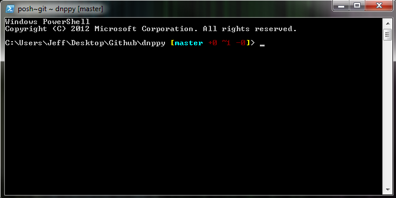
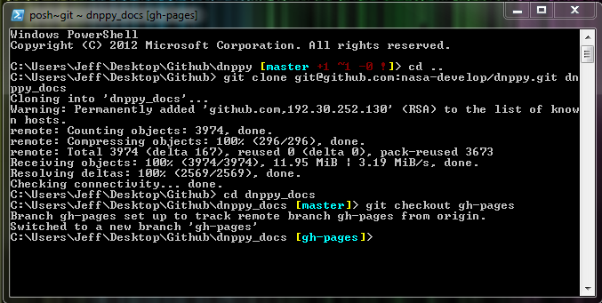

Building Docs
=============

One of the most important aspects of writing good software is documentation. This website is generated automatically from the source files in ``dnppy/docs/source`` with `Sphinx`_ and `graphviz`_.

.. rubric:: Building the docs

Building docs with dnppy will require use of the git shell, so if you are accustomed to using the github for windows client, open up the git shell from the settings menu. It will look something like this.

We will use this interface to set up a separate copy of this repository to interface with the gh-pages branch. Branches with this name are specially treated by GitHub specifically for hosting documentation pages.

First, we ``cd`` (change directory) up one level out of our repository, and create a clone of dnppy in a new folder called "dnppy_docs", and switch over to the gh-pages branch on that directory.

    > cd ..
    > git clone git@github.com:nasa-develop/dnppy.git dnppy_docs
    > cd dnppy_docs
    > git checkout gh-pages

Which, when typed into the shell looks like this:

Now you have a copy of the gh-pages branch!

1. As with other required libraries in dnppy, you do not need to manually set up the required packages. Simply run ``dev/sphinx_build.py``, and all the required libraries will be fetched and installed from the python package index if you don't yet have them.

2. Once you've run ``sphinx_build.py``, a ``docs/build`` folder will appear with the entire contents of this website. You can open up ``index.html`` to view a locally hosted version. You can always re-run this script to create an updated build of the doc pages.

.. _Sphinx: http://sphinx-doc.org/
.. _graphviz: http://www.graphviz.org/

